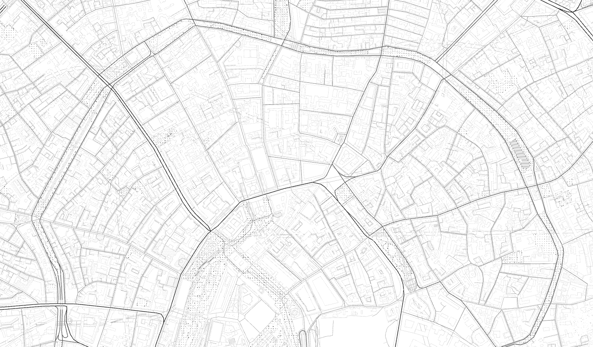

# mapzen-slippy-map



Mapzen maps. In a browser. Full-screen. With the ability to screenshot themselves.

## Caveats

This doesn't do a _bunch_ of things that any normal map does, yet.

## How to use this thing

Put it on a web server. Or: Use the handy `slippy` target in the included Makefile.

Like this:

```
make slippy
```

This will start a small [local web server](https://github.com/whosonfirst/go-whosonfirst-fileserver) that you can visit in your web browser by going to `http://localhost:8080`

If you don't know what a "Makefile" is or don't make the `make` program installed on your computer you can start `mapzen-slippy-map` by hand, from the command-line, like this:

```
./utils/PLATFORM/www-server -path ./www
```

Where `PLATFORM` should be one of the following:

* darwin (as in Mac OS X)
* linux
* windows

## Toggling between map styles

## Shift-B

Load the `bubble-wrap` style.

## Shift-C

Load the `cinnabar` style.

## Shift-L

Toggles between labeled and unlabeled versions of the current style. _This is still a bit clunky and does not apply to the `bubble-wrap` style._

## Shift-R

Load the `refill` style.

## Shift-Z

Load the `zinc` style.

## Screenshots

## Shift-S

This will create a screenshot of the current map view and open it up in another browser tab.

## Ctrl-Shift-S

This will create a screenshot of the current map view and try to save it to the place your browser saves downloads. Filenames are generated as follows:

"slippy-map-" + `MAP STYLE` + "-" + `UNIX TIMESTAMP` + "-" `GEOHASH(SW lat,lon)` + "-" + `GEOHASH(NE lat,lon)` + ".png"

## Updating the map styles

Run the handy `make mapzen` target in the included Makefile to update all map styles (and their assets) from source.

## Things that `mapzen-slippy-map` still needs to learn how to do

* Search
* Geolocation
* Maybe GetLatLon style coordinate display? 
* Screenshot controls for touch devices

## See also

* https://github.com/tangrams/


